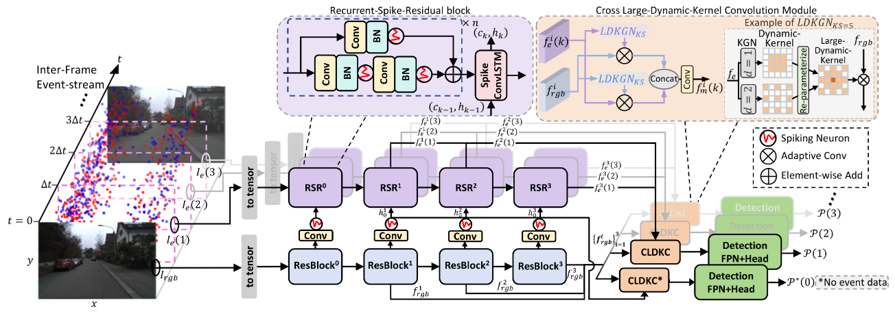

# EFH
The source code for paper: [Event-Fused Hybrid ANN-SNN Architecture for Low-Latency Object  Detection in Automotive Vision](https://ieeexplore.ieee.org/abstract/document/11386767)


## Method


## Prepare python env 
python=3.8.13
```
# install torch
pip install torch==2.0.0+cu117 torchvision==0.15.0+cu117 torchaudio==2.0.0+cu117 --extra-index-url https://download.pytorch.org/whl/cu117
# install yolox
bash llibs/download_install.sh
# install packages
pip install -r requirements.txt
```
## Prepare datasets
The DSEC Dataset can download from [DSEC-detection](https://dsec.ifi.uzh.ch/dsec-detection/),
follow [DAGr](https://github.com/uzh-rpg/dagr) to prepare the dataset
#### Expected dataset structure for DSEC-detection :
```
dsec/
    ├── {train,test}/
        ├── interlaken_00_c/
            ├── events/left/
                └── events_2x.h5
            ├── images/left/distorted/
                └── *.png
    ├── train_val_test_spilt.xml
```
### PKU-DAVIS-SOD
The PKU-DAVIS-SOD Dataset can download from [PKU-DAVIS-SOD](https://git.openi.org.cn/LiDianze/PKU-DAVIS-SOD)，follow 
```
python ./data/davis346_temporal_event_to_npy.py
python ./data/davis346_to_images.py
```
convert the raw .aedat4 files to synrhronous frames (.png), events (.npy) and the pairs dir. 
#### Expected dataset structure for PKU_DAVIS_SOD:
```
 PKU_DAVIS_SOD/
    ├── aps_frames/
        ├── {train,val,test}/
            ├── {normal,low_light,motion_blur}/
                └── 001_train_normal/
                    └── *.png
    └── events_npys/
        ├── {train,val,test}/
    └── annotations/
        ├── {train,val,test}/
    └── pairs/
        ├── {train,val,test}/
```

## Train 


## Citation
If our work help to your research, please cite our paper, thx.
```
@ARTICLE{11386767,
  author={Zhang, Chengjun and Zhang, Yuhao and Yu, Jisong and Yang, Jie and Sawan, Mohamad},
  journal={IEEE Robotics and Automation Letters}, 
  title={Event-Fused Hybrid ANN-SNN Architecture for Low-Latency Object Detection in Automotive Vision}, 
  year={2026},
  volume={11},
  number={3},
  pages={3622-3628},
  keywords={Object detection;Cameras;Feature extraction;Low latency communication;Vehicle dynamics;Robot vision systems;Event detection;Autonomous vehicles;Training;Standards;Computer vision for automation;deep learning for visual perception;deep learning methods},
  doi={10.1109/LRA.2026.3662637}}
```

## Thanks to these amazing projects:
- [spikingjelly](https://github.com/fangwei123456/spikingjelly)
- [YOLOX](https://github.com/Megvii-BaseDetection/YOLOX)
